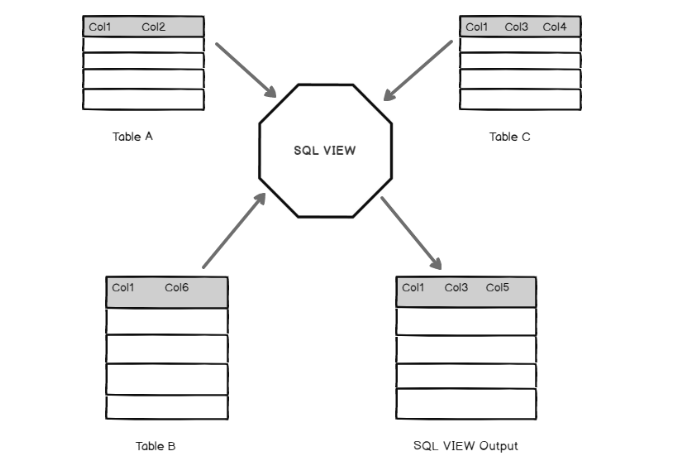

# Aula 2 - Definições

## Estruturas

### Banco de Dados

- A entidade maior é o banco de dados
- Banco de dados é um repositório de dados que podem ser reivindicados, ocupando espaço em disco
- Formado por campos (colunas) e registros (linhas)

### Banco de Dados -> Entidades

- Estruturas que organizam o armazenamento de dados no banco de dados -> **TABELA**

- **Tabela**: conjunto de colunas e linhas, onde a interseção das mesmas são chamadas de células

- Quando criamos uma tabela em um banco de dados, precisamos dizer quantos campos a tabela deve ter e quais serão os seus tipos.

- **Chave Primária (Primary Key)**: Se um campo ou mais forem chaves primárias, as combinações dos valores destes campos não podem se repetir em uma tabela. Funcionam como um "identificador" para a tabela.

- **Chave Estrangeira (Foreign Key)**: Uma chav eestrangeira permite que diferentes tabelas dentro de um banco de dados possam ter informações relacionadas, garantindo integridade ao banco de dados.

- **Índices**: Campo destinado a encontrar as informações no banco de dados de forma mais rápida. Quando criamos chaves primárias ou chaves estrangeiras, de forma implícita o banco de dados torna aquelas chaves campos índices para otimizar a busca por valores específicos.

### Banco de Dados -> Grupo de Tablelas de mesmo assunto == Esquemas (Schemas)

- Esquemas são grupos de tabelas que representam o mesmo assunto.

### Banco de Dados -> View 

- Normalmente, para não criar-se tabelas em bancos de dados tão grandes e pesadas, usa-se um processo de normalização, que consiste em dividir os dados de uma grande tabela em tabelas menores relacionadas por foreign keys.
- Imagine o quão estressante seria fazer uma query para todas essas tabelas...
- View é um tipo de entidade virtual no banco de dados que já possui uma certa quantidade de queries para buscar dados em diversas tabelas splitadas desta forma.

### Consultas

- Consultas em bancos de dados são feitas por meio de **queries**
- Queries são comandos para buscar dados dentro de um banco, podendo ou não utilizarem-se de **filtros**, para filtrar e criar condições aos dados que estão sendo buscados
- Caso desejemos realizar consultas em múltiplas tabelas, primeiro precisamos utilizar o método **join** (quem sabe depois transformar em uma views)

### Procedures e Funções

- Dentro do SQL, desenvolvedores foram deixando de lado o padrão ANSI e criando suas próprias rotinas e códigos para criar determinadas lógicas que não existem dentro do SQL, como If, Else, While etc...isto são chamdas de **procedures** (internas aos bancos de dados). Estas procedures são feitas com linguagens proprietárias que permitem a criação de **lógica estruturada** utilizando comandos SQL
- Assim, podemos agrupar nossos prórpios comandos de lógica dentro de **funções** ou usar fruto de funções internas dos bancos de dados

### Trigger

- São disparos (procedures ou funções) caso certas ocorrências venham a acontecer no banco de dados